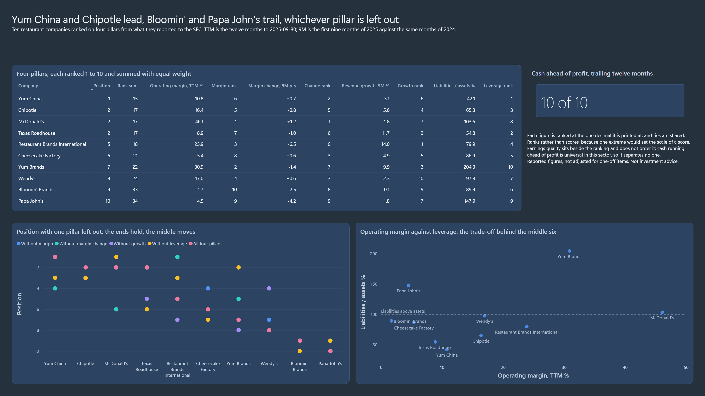

# US Restaurant Financials: A Peer Analysis

A position on the relative financial health of ten restaurant companies, from
what they reported to the SEC up to the quarter ended 2025-09-30. It is built
on the published Parquet output of
[sec-edgar-financial-pipeline](https://github.com/rdiguglielmo/sec-edgar-financial-pipeline)
rather than on a pipeline of its own.

**Yum China and Chipotle are the healthiest of the ten; Bloomin' Brands and
Papa John's are the weakest.** Those four places hold whichever of the four
ranking pillars is left out. The argument, question by question and with the
filings read for each cause, is in [ANALYSIS.md](ANALYSIS.md).

Part of a [data portfolio](https://github.com/rdiguglielmo).

## Business Questions

1. **Is growth sustainable?** How fast revenue grows, and how much of it is
   bought.
2. **Are margins improving or deteriorating?** And how much of each move comes
   from outside operations.
3. **Is there operating deterioration?** Read through liquidity.
4. **Are there early signs of risk?** Leverage, and profit running ahead of
   cash.
5. **Ranked by financial health, in what order, and why?**

The fifth forces a position. [Results](#results) answers each in a few lines;
[ANALYSIS.md](ANALYSIS.md) answers each at length.

## Dataset

Seven Parquet files, 2 MB, committed in [`data/parquet/`](data/parquet/): the
complete fact table of 22,604 facts over 1,066 accounting concepts, five
dimensions, and the upstream quality history.

The source is the SEC EDGAR financial statement data sets, extracted and
modelled by [sec-edgar-financial-pipeline](https://github.com/rdiguglielmo/sec-edgar-financial-pipeline). The scope is ten companies
under SIC 5810 and 5812. **Two codes, not one**: they name the same business
and the filer picks which to use, so any sector statement has to say which
codes it treats as equivalent.

Copying the output rather than depending on the upstream database is what lets
this repository clone and run: no ingestion, no credentials, no 3 GB warehouse
to build first.

## Concept Mapping

Ten companies report the same economics under different US-GAAP elements, and
no single element carries revenue or the bottom line for all ten.
[`data/concept_mapping.csv`](data/concept_mapping.csv) holds the accepted
elements per business concept in priority order;
[`docs/concept_mapping_rationale.md`](docs/concept_mapping_rationale.md)
records the measurement behind every choice, including the three metrics that
are not computed and the number that rules each one out.

## Metric Definitions

Eight metrics, each measured with the aggregation flags applied:

| Metric | Definition | Companies with a figure at 2025-09-30 |
|---|---|---|
| Operating margin | Operating income / revenue | 10 |
| Net margin | Net income / revenue | 10 |
| Revenue growth | Against the same period a year earlier, with a 52-week equivalent where a 53-week year is involved | 10 |
| Return on equity | Trailing-twelve-month net income / equity at the period end | 7 |
| Debt to equity | Total liabilities / total equity | 7 |
| Current ratio | Current assets / current liabilities | 10 |
| Accruals ratio | (Profit - operating cash flow) / total assets | 10 |
| Operating cash flow / profit | Operating cash flow / consolidated profit | 9 |

The gaps are rules, not missing data: a ratio over negative equity or over a
loss is null rather than a number that reads as small. The formulas, the rule
for each null and flag, and the query section that prints every figure are in
[`docs/metric_definitions.md`](docs/metric_definitions.md).

Three metrics are not computed. Interest coverage, gross margin and cost growth
rest on elements that reach 1, 4 and 4 of the ten companies.

## Reconciliation Gate

This project recalculates ratios over a warehouse another project built. It has
no quality layer of its own, so the gate stands in its place: the figures
computed here must reproduce the ones the upstream project published, or
neither ships.

```
.venv/Scripts/python src/query.py sql/00_reconciliation_gate.sql
```

Seven sections, each stating its expected answer above its result. Three of them
check rules this project had to establish rather than inherit: the taxonomy-version
tie-break, the balance-sheet identity and the return-on-equity pairing, all three
set out in [`docs/engineering-notes.md`](docs/engineering-notes.md).

The analysis itself runs as one chain, `sql/01` to `sql/05`, and carries 28
more checks written the same way. They cover:

- the statements, against the gate and against figures read from the filed
  documents;
- the metrics, against values worked out beforehand;
- the ranking, against three companies ranked by hand.

`src/export.py` adds three checks on the file it writes.

## Dashboard

One page in Power BI, whose title is the claim the analysis makes.



[The page as PDF](powerbi/dashboard.pdf)

- **Four pillars, each ranked 1 to 10 and summed with equal weight.** The
  ranking, with each pillar's figure and rank.
- **Position with one pillar left out.** Each dot is a company's position under
  one variant of the ranking. The ends hold: Yum China and Chipotle never fall
  below 4th, and Bloomin' and Papa John's never rise above 9th. The middle
  moves.
- **Operating margin against leverage.** This is the trade-off that orders the
  middle six, with a line where liabilities equal assets. McDonald's and Yum
  Brands have the two highest margins, and liabilities above their assets.
- **Cash ahead of profit, 10 of 10.** This is why earnings quality sits beside
  the ranking rather than in it: operating cash flow runs ahead of profit at
  every company.

**The page computes nothing.** It reads one file,
[`output/peer_ranking.parquet`](output/peer_ranking.parquet), which
[`src/export.py`](src/export.py) writes from the SQL view the analysis cites.
Every measure on the page returns one value of one row, so the ranking has a
single implementation and the page cannot disagree with the analysis.
Recomputing it in DAX would have meant a second implementation of every rule
above, with nothing to catch a difference between the two.

The theme is Performance Dark from
[powerbi-theme-lab](https://github.com/rdiguglielmo/powerbi-theme-lab), used
unchanged. The report files are not published; see
[What Is Not in This Repository](#what-is-not-in-this-repository).

## How to Run

Requires Python 3.12, the version this is verified on. No accounts, no cloud,
no services to start.

```bash
git clone https://github.com/rdiguglielmo/us-restaurant-financials-analysis
cd us-restaurant-financials-analysis
python -m venv .venv
.venv/Scripts/pip install -r requirements.txt      # Linux/macOS: .venv/bin/pip
```

```bash
.venv/Scripts/python src/query.py sql/00_reconciliation_gate.sql
.venv/Scripts/python src/query.py sql/01_concept_resolution.sql sql/02_financial_statements.sql sql/03_ratios.sql sql/04_earnings_quality.sql sql/05_peer_ranking.sql
```

The first command proves that the inputs reproduce the upstream project's
published figures. The second prints every figure [ANALYSIS.md](ANALYSIS.md)
cites, each check with its expected answer above its result. The files run in
the order given, on one in-memory connection, so there is no database to
build.

The file the dashboard reads, `output/peer_ranking.parquet`, is committed. To
write it again:

```bash
.venv/Scripts/python src/export.py
```

It runs the chain, writes the file and reads it back. Given the same inputs it
writes the same bytes, and it prints the SHA-256 to show it.

Any other query runs through the same runner; see
[`docs/engineering-notes.md`](docs/engineering-notes.md#running-a-query).

## Results

A bracketed label is a section of the SQL files, as in
[ANALYSIS.md](ANALYSIS.md): [K8] is in
[`sql/05_peer_ranking.sql`](sql/05_peer_ranking.sql), [R4] in
[`sql/03_ratios.sql`](sql/03_ratios.sql). A figure read from a filing names
the filing.

1. **Growth is fastest where restaurants were bought.** Revenue over the first
   nine months of 2025 ranges from 14.0% at Restaurant Brands International
   down to -2.3% at Wendy's, whose revenue fell in every quarter of 2025 [K8].
   The two fastest growers, Restaurant Brands and Texas Roadhouse (11.7%),
   both include acquired restaurants (Q3 2025 10-Qs).
   [More](ANALYSIS.md#1-is-growth-sustainable)
2. **Four margins widened and six narrowed, and the two largest falls come
   mostly from outside operations.** Over the nine months, operating margin
   moved from +1.2 points at McDonald's to -6.5 at Restaurant Brands [K2]. Of
   Restaurant Brands' 6.5 points, 4.1 are exchange losses and a gain in the
   2024 base. Of Papa John's 4.2, 2.7 are a property gain in the 2024 base
   (Q3 2025 10-Qs). Bloomin's fall is operational: its margin has declined
   every year, from 7.6% in FY2022 to 1.7% over the trailing year [K9].
   [More](ANALYSIS.md#2-are-margins-improving-or-deteriorating)
3. **Liquidity shows no operating deterioration.** Seven of the ten current
   ratios rose between the FY2024 close and 2025-09-30 [K7]. The largest fall,
   Wendy's from 1.85 to 0.81 [K7], is notes coming within a year of repayment,
   a financing event (Q3 2025 10-Q).
   [More](ANALYSIS.md#3-is-there-operating-deterioration)
4. **The warning signs are on the balance sheet, not in earnings quality.**
   McDonald's, Papa John's and Yum Brands carry negative book equity [K4].
   Wendy's has equity of 2.2% of its assets [R4], liabilities up 3.0 points to
   97.8% [K2, K7], and falling revenue. Operating cash flow exceeds profit at all
   40 trailing observations [K5].
   [More](ANALYSIS.md#4-are-there-early-signs-of-risk)
5. **Yum China first, Bloomin' and Papa John's last, whatever the weights.**
   Yum China ranks first on a rank sum of 15, and Chipotle, McDonald's and
   Texas Roadhouse share second on 17. Bloomin' is 9th on 33 and Papa John's
   10th on 34 [K2]. With one pillar left out at a time:
   - Yum China and Chipotle never fall below 4th;
   - Bloomin' and Papa John's never rise above 9th;
   - the middle six move between 1st and 8th, so their order is a statement
     about weights, not about the companies [K3].

   [More](ANALYSIS.md#what-the-ranking-claims-and-what-it-does-not)

## What I Learned

**The join that duplicates survives every flag.** The upstream fact table
flags segment, superseded and year-to-date rows. But its account dimension is
grained on element *and* taxonomy version, so a figure filed under two
taxonomy years comes back twice with every flag set correctly. That was 465 of
6,717 company, concept and period combinations, and up to four rows for one
figure. In 464 the duplicates agree, which is what makes the problem look
harmless. In one they differ by 17.9%, and a `max()` would have picked the
larger figure without a word. Every resolution now breaks the tie on taxonomy
version, and the gate measures the duplication again on every run.

**Coverage has to be counted with the filters the metric will apply.** Counted
raw, the preferred revenue element reached 7 companies and cost of revenue 6.
With the flags applied they reach 4 and 4, because the raw facts are mostly
segment detail. That difference decided which metrics exist: gross margin is
not computed, and revenue resolves through three elements instead of one.

**A rank sees differences the table cannot print.** On exact values, 0.0008 of
a point of growth separated Papa John's from McDonald's. That gap was a full
place in the pillar and a point in the sum, between two figures that both
print as 1.8. Ranking the figure at its published precision, with ties shared,
is what lets anyone recompute a rank from the table.

**A metric with one sign across the group cannot order it.** Accruals are
negative in all 40 trailing observations, because depreciation puts cash ahead
of profit at every company in the sector. Ranked, they reward a fall in profit
and put the two weakest companies first. So they sit beside the ranking, as a
tripwire.

**A cause is an expectation too, and it fails like one.** Four causes were
written down before the quarterly filings were read, and two did not hold. An
acquisition believed to be in revenue is reported as a discontinued operation.
A margin decline attributed to a charge this year turned out to be a gain
leaving last year's base. Inferred from the ratios alone, either would have
been published.

## What Is Not in This Repository

Every absence below is deliberate. The first five are what a pipeline project
carries, and they exist upstream, in
[sec-edgar-financial-pipeline](https://github.com/rdiguglielmo/sec-edgar-financial-pipeline):

| Absent | Why |
|---|---|
| Architecture diagram | There is no architecture of its own here, only a folder of Parquet |
| Star schema diagram | The star belongs to the project that built it, so it is [linked](https://github.com/rdiguglielmo/sec-edgar-financial-pipeline#data-modeling), not redrawn |
| Data quality layer | The input quality is the upstream project's, with its 156 checks and 10 documented failures. Duplicating them proves nothing new. The reconciliation gate replaces it |
| Incremental ingestion | There is no ingestion |
| Data Quality dashboard page | With no quality layer of its own there is nothing to report |
| Segment-level comparison | 438 of the 468 segment strings in scope are used by a single company, so a cross-company mapping would be hand-written with almost no reuse, and would change none of the conclusions |
| Power BI project files | The semantic model and the page definitions are machine-written JSON that reads as nothing. They are not published: the screenshot and the PDF above are the deliverable, and every figure on them is a column of the exported file |

## Limitations

- **Gross margin and interest coverage cannot be compared.** Cost of revenue
  reaches 4 of the ten companies once the flags are applied, and interest
  expense reaches 1.
- **Organic and acquired growth are separated only where a filing was read for
  it.** That covers two companies, Restaurant Brands and Texas Roadhouse. For
  the other eight, growth is as reported.
- **A snapshot at 2025-09-30.** The ranking reads one trailing-twelve-month
  date and one nine-month window, the latest every company has filed.
- **Three annual points, and only two on the balance sheet.** Annual facts
  exist for 2022 to 2024, so any year-over-year series runs on three points.
  Balance-sheet concepts are complete only from 2023-12-31, which is two annual
  closes, so the ratios built on them are carried quarterly instead.
- **The fourth quarter is never filed on its own.** It is derived as the full
  year less the nine-month year to date.
- **Four of the thirty fiscal years run 53 weeks.** They touch 6 of the 20
  annual growth comparisons, which carry a 52-week equivalent beside the
  reported figure; the nine-month window holds none.
  - Texas Roadhouse's trailing flows at 2025-09-30 cover 53 weeks. That lifts
    its return on equity by about 0.6 points but not its margins, where both
    sides of the ratio cover the same weeks.
- **Reported figures, unadjusted.** One-off items stay in the figures, and
  [ANALYSIS.md](ANALYSIS.md) sizes each from the filing.
- **Currency.** Yum China earns in renminbi and reports in dollars, so its
  growth and margins include the exchange rate.
- **Three companies carry negative book equity** from buybacks. Return on
  equity and debt to equity are null for them rather than a small number.
- **Custom tags are not comparable across companies**, and this analysis does
  not use any.
- **Ten companies under two SIC codes**, 5810 and 5812, treated as one
  industry.
- **This is an analysis of figures reported to the SEC. It is not investment
  advice.**
